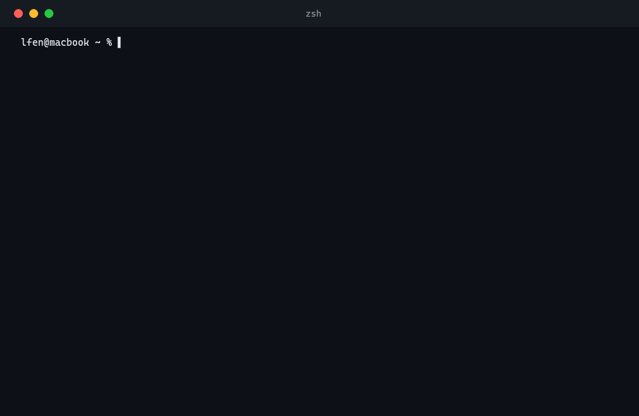

<p align="center">
  
</p>

<p align="center">
  
</p>

<p align="center">
  <a href="https://github.com/LFenX/LFen-Skills/actions/workflows/catalog.yml">
    
  </a>
  
  
  
</p>

<p align="center">
  <a href="README.en.md"></a>
  <a href="SKILLS.en.md"></a>
  <a href="README.md"></a>
</p>

## Install

**Windows**

```powershell
iwr https://raw.githubusercontent.com/LFenX/LFen-Skills/main/install.ps1 | iex
```

**macOS / Linux**

```bash
curl -fsSL https://raw.githubusercontent.com/LFenX/LFen-Skills/main/install.sh | bash
```

<details open>
<summary><b>Windows (PowerShell)</b></summary>

<p align="center">
  
</p>

</details>

<details>
<summary><b>macOS / Linux (bash)</b></summary>

<p align="center">
  
</p>

</details>

Follow the prompts to pick platforms and skills. Skills are linked (junction on Windows, symlink elsewhere) to a local clone at `~/.lfenskills` (only directories holding a `SKILL.md` are installed), so a plain `git pull` there updates everything in place.

```powershell
.\install.ps1 -Status                    # Per platform: missing, dangling, copied or mislinked entries
.\install.ps1 -Update                    # Selectively refresh skills
.\install.ps1 -Claude -Codex -AllSkills  # Install to the named platforms only
.\install.ps1 -All -AllSkills -Force     # Silent full install
```

```bash
bash install.sh --status                 # Same as above
bash install.sh --update --all-skills    # Refresh every installed skill
bash install.sh --claude --codex --all-skills
```

### Checking install entries

Install entries live outside the repository, so moving or renaming a skill directory can leave them dangling or pointing at an old version. Installing and updating relink skills that moved and remove links into `~/.lfenskills` whose target is gone or is not a skill; a real directory named like a skill (a copy) is never deleted or replaced — move it away first. You can check at any time from the repository or from `~/.lfenskills`:

```bash
python scripts/check_install_links.py                                          # Platforms with LFen skills installed
python scripts/check_install_links.py --platform claude,codex,opencode,cursor  # Require every skill on these platforms
```

It exits 1 when anything is missing, dangling, copied or mislinked; an install clone that is behind the remote is reported but not counted as a problem. The rules are the same as `install.ps1 -Status` and `install.sh --status`.

## Skills

Detailed introductions for every skill live on the **[Skills](SKILLS.en.md)** page.

<details>
<summary>📑 Index table (generated, do not edit)</summary>

<!-- catalog-summary:start -->
| Category | Skill | Description |
| --- | --- | --- |
| [**Data&nbsp;Processing**](CATALOG.md#data-processing) |  | Matching, cleaning, transforming, analyzing, and verifying structured data. |
|  | [`fetch-xhs-interaction-metrics`](skills/data-processing/fetch-xhs-interaction-metrics/SKILL.md) | Extract likes, collections, comments, and visible share counts from public Xiaohongshu note URLs, preferring structured page state, network responses, and DOM; use an existing browser session only when required fields remain missing behind a login or app-only gate. |
|  | [`match-tabular-records`](skills/data-processing/match-tabular-records/SKILL.md) | Reconcile two CSV/XLSX tables by one field or an ordered composite of multiple fields, with configurable exact, text, identifier, number, date, or datetime normalization. |
| [**Product&nbsp;Engineering**](CATALOG.md#product-engineering) |  | Product definition, development execution, quality control, delivery, and operations. |
|  | [`build-large-web-project-zero-to-one`](skills/product-engineering/build-large-web-project-zero-to-one/SKILL.md) | From a basic product brief to frontend-backend integration and acceptance, using requirement tracing, PRD, product package, Feishu doc and base records, template or designated UI, control binding, and rework loops to help a coding agent build a complex large-scale web admin from zero to one. |
|  | [`run-governed-product-workflow`](skills/product-engineering/run-governed-product-workflow/SKILL.md) | Drive concrete development tasks such as new features, requirement changes, bug fixes, refactors, migrations and retirement, releases, and re-acceptance — frontend, backend, scripts, config, and docs alike. |
|  | [`run-koc-feedback-workflow`](skills/product-engineering/run-koc-feedback-workflow/SKILL.md) | Filter, list, claim, and drive development items from the KOC feedback base, syncing clarification, planning, execution, review, rework, and completion status after user authorization. |
| [**Dev&nbsp;Tools**](CATALOG.md#dev-tools) |  | Setup, integration, troubleshooting, and maintenance for dev environments, toolchains, and AI coding assistants. |
|  | [`add-opencode-model-provider`](skills/dev-tools/add-opencode-model-provider/SKILL.md) | Connect opencode to third-party OpenAI-compatible model providers such as a LiteLLM gateway. |
| [**Debugging**](CATALOG.md#debug) |  | Record and unpack confirmed execution problems, keeping observations separate from inferences. |
|  | [`record-skill-incident`](skills/debug/record-skill-incident/SKILL.md) | Record a confirmed Agent Skill incident as JSON, keeping verifiable observations separate from inferred causes. |
<!-- catalog-summary:end -->

Full catalog in [`CATALOG.md`](CATALOG.md); machine-readable index in [`catalog/index.json`](catalog/index.json).

</details>

## Supported Platforms

| Platform | Skill Directory | Notes |
| --- | --- | --- |
| OpenCode | `~/.agents/skills/` | Also covers Cline, Warp, Zed, Kilo, Kimi, Droid, Firebender, and 20+ more |
| Claude Code | `~/.claude/skills/` | |
| Codex | `~/.codex/skills/` | |
| Cursor | `~/.cursor/skills/` | |
| Gemini CLI | `~/.gemini/skills/` | |
| GitHub Copilot | `~/.copilot/skills/` | |
| Windsurf | `~/.codeium/windsurf/skills/` | |

## Adding a Skill

1. Create `skills/<category>/<skill-name>/SKILL.md` — the directory name must match the frontmatter `name`, and the frontmatter must include `name`, `description` (Chinese), and `description_en` (English).
2. Add the skill to the matching leaf category in `catalog/taxonomy.json`, with `scope` and sorted `tags` under `skill_metadata`.
3. Run `python scripts/update_catalog.py` to regenerate `README.md`, `README.en.md`, `SKILLS.md`, `SKILLS.en.md`, `CATALOG.md`, and `catalog/index.json`.
4. Run `python scripts/update_catalog.py --check` to verify, then commit and push.

When you move or rename an existing skill directory, step 3 lists the install entries that still point at the old location and runs the install entry check. After pushing, run `git -C ~/.lfenskills pull` on each machine, then `install.ps1 -Update` or `bash install.sh --update`, and confirm with `python scripts/check_install_links.py`.

## License

[MIT](LICENSE)

<p align="center">
  
</p>
