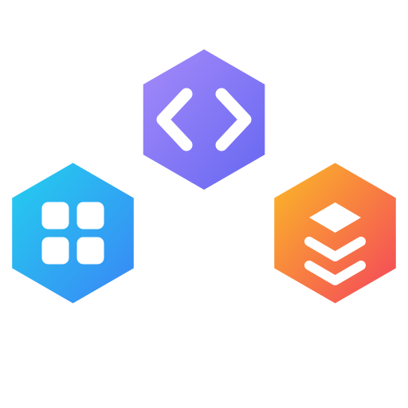

<p align="center">
  
</p>

<p align="center">
  Agent Skills distilled from my own work and study — feel free to take whatever is useful to you.<br>
  Every skill is self-contained, installed to 7 platforms with one command.
</p>

<p align="center">
  <a href="https://github.com/LFenX/LFen-Skills/actions/workflows/catalog.yml">
    
  </a>
  
</p>

<p align="center">
  <a href="README.md">中文</a> &nbsp;|&nbsp; <b>English</b>
</p>

## Install

**Windows**

```powershell
iwr https://raw.githubusercontent.com/LFenX/LFen-Skills/main/install.ps1 | iex
```

**macOS / Linux**

```bash
curl -fsSL https://raw.githubusercontent.com/LFenX/LFen-Skills/main/install.sh | bash
```

Follow the prompts to pick platforms and skills. Skills are linked (junction on Windows, symlink elsewhere) to a local clone at `~/.lfenskills`, so a plain `git pull` there updates everything in place.

```powershell
.\install.ps1 -Status                    # Show what's installed where
.\install.ps1 -Update                    # Selectively refresh skills
.\install.ps1 -All -AllSkills -Force     # Silent full install
```

## Supported Platforms

| Platform | Skill Directory | Notes |
| --- | --- | --- |
| OpenCode | `~/.agents/skills/` | Also covers Cline, Warp, Zed, Kilo, Kimi, Droid, Firebender, and 20+ more |
| Claude Code | `~/.claude/skills/` | |
| Codex | `~/.codex/skills/` | |
| Cursor | `~/.cursor/skills/` | |
| Gemini CLI | `~/.gemini/skills/` | |
| GitHub Copilot | `~/.copilot/skills/` | |
| Windsurf | `~/.codeium/windsurf/skills/` | |

## Skills

| Category | Description | Skills |
| --- | --- | --- |
| [Data Processing](CATALOG.md#data-processing) | Matching, cleaning, transforming, and verifying structured data. | [`match-tabular-records`](skills/data-processing/match-tabular-records/SKILL.md) |
| [Product Engineering](CATALOG.md#product-engineering) | Product definition, development, quality control, delivery, and operations. | [`build-large-web-project-zero-to-one`](skills/product-engineering/build-large-web-project-zero-to-one/SKILL.md), [`run-governed-product-workflow`](skills/product-engineering/run-governed-product-workflow/SKILL.md), [`run-koc-feedback-workflow`](skills/product-engineering/run-koc-feedback-workflow/SKILL.md) |
| [Dev Tools](CATALOG.md#dev-tools) | Setup, integration, and troubleshooting for dev environments, toolchains, and AI coding assistants. | [`add-opencode-model-provider`](skills/dev-tools/add-opencode-model-provider/SKILL.md) |

Full catalog in [`CATALOG.md`](CATALOG.md); machine-readable index in [`catalog/index.json`](catalog/index.json).

## Adding a Skill

1. Create `skills/<category>/<skill-name>/SKILL.md` — the directory name must match the frontmatter `name`.
2. Add the skill to the matching leaf category in `catalog/taxonomy.json`, with `scope` and sorted `tags` under `skill_metadata`.
3. Run `python scripts/update_catalog.py` to regenerate the README summary, `CATALOG.md`, and `catalog/index.json`.
4. Run `python scripts/update_catalog.py --check` to verify, then commit and push.

## License

[MIT](LICENSE)
