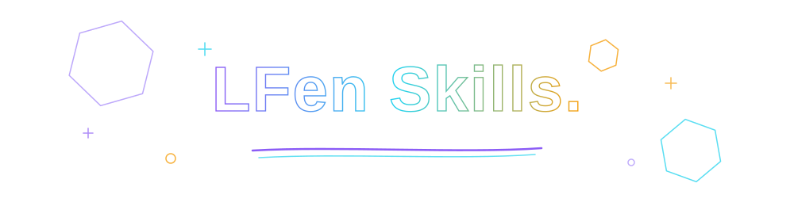
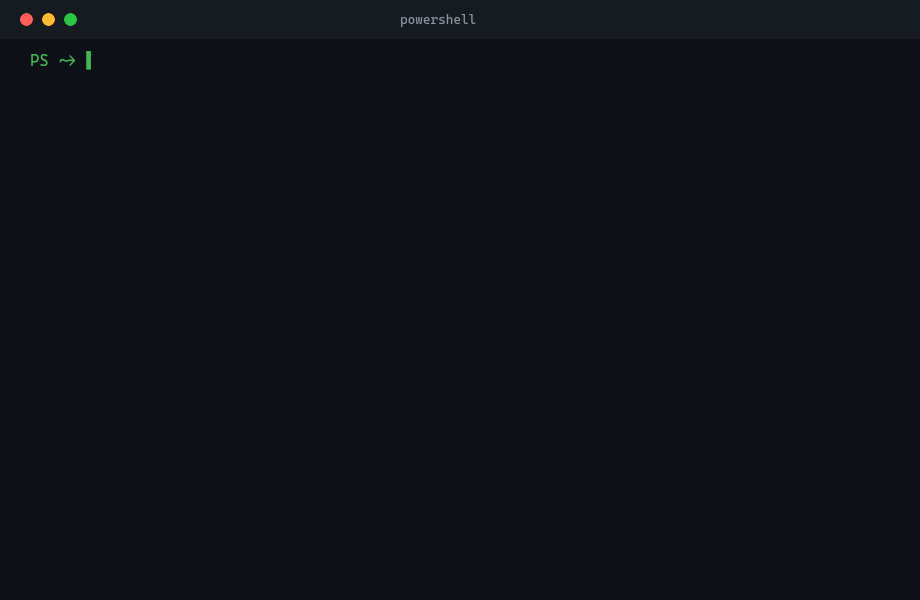
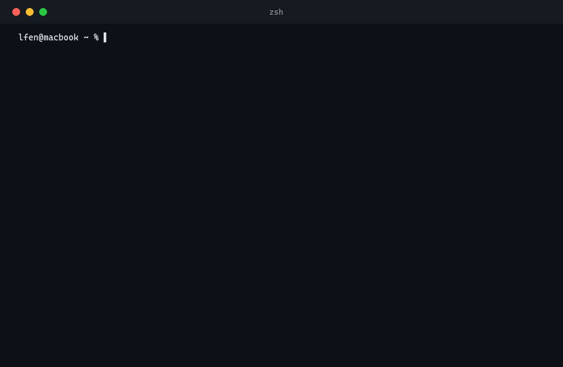

<p align="center">
  
</p>

<p align="center">
  <sub>MARK ZUCKERBERG · HARVARD COMMENCEMENT 2017</sub><br><br>
  <small>“Ideas don’t come out fully formed.<br>
  They only become clear as you work on them.<br>
  <strong>You just have to get started.</strong>”</small><br><br>
  <sub><a href="https://news.harvard.edu/gazette/story/2017/05/mark-zuckerbergs-speech-as-written-for-harvards-class-of-2017/">Read the speech ↗</a></sub>
</p>

<p align="center">
  <a href="https://github.com/LFenX/LFen-Skills/actions/workflows/catalog.yml">
    
  </a>
  
  
  
</p>

<p align="center">
  <a href="README.en.md"></a>
  <a href="SKILLS.en.md"></a>
  <a href="README.md"></a>
</p>

## Install

**Windows**

```powershell
iwr -UseBasicParsing https://raw.githubusercontent.com/LFenX/LFen-Skills/main/install.ps1 | iex
```

**macOS / Linux**

```bash
bash -o pipefail -c '
  curl -fsSL https://raw.githubusercontent.com/LFenX/LFen-Skills/main/install.sh | bash
'
```

### Choose a command for one skill

Expand a skill, then a target platform, and copy the full command for your operating system. This list is generated from `skills/`; skill descriptions are in [`SKILLS.en.md`](SKILLS.en.md).

<!-- install-commands:start -->
<details name="install-skill">
<summary><code>add-opencode-model-provider</code></summary>

<details name="install-platform-add-opencode-model-provider">
<summary>OpenCode</summary>

**Windows (PowerShell)**

```powershell
& ([scriptblock]::Create(
  (irm https://raw.githubusercontent.com/LFenX/LFen-Skills/main/install.ps1 -ErrorAction Stop)
)) -OpenCode -Skill add-opencode-model-provider
```

**macOS / Linux (Bash)**

```bash
bash -o pipefail -c '
  curl -fsSL https://raw.githubusercontent.com/LFenX/LFen-Skills/main/install.sh |
    bash -s -- --opencode --skill add-opencode-model-provider
'
```

</details>

<details name="install-platform-add-opencode-model-provider">
<summary>Claude Code</summary>

**Windows (PowerShell)**

```powershell
& ([scriptblock]::Create(
  (irm https://raw.githubusercontent.com/LFenX/LFen-Skills/main/install.ps1 -ErrorAction Stop)
)) -Claude -Skill add-opencode-model-provider
```

**macOS / Linux (Bash)**

```bash
bash -o pipefail -c '
  curl -fsSL https://raw.githubusercontent.com/LFenX/LFen-Skills/main/install.sh |
    bash -s -- --claude --skill add-opencode-model-provider
'
```

</details>

<details name="install-platform-add-opencode-model-provider">
<summary>Codex</summary>

**Windows (PowerShell)**

```powershell
& ([scriptblock]::Create(
  (irm https://raw.githubusercontent.com/LFenX/LFen-Skills/main/install.ps1 -ErrorAction Stop)
)) -Codex -Skill add-opencode-model-provider
```

**macOS / Linux (Bash)**

```bash
bash -o pipefail -c '
  curl -fsSL https://raw.githubusercontent.com/LFenX/LFen-Skills/main/install.sh |
    bash -s -- --codex --skill add-opencode-model-provider
'
```

</details>

<details name="install-platform-add-opencode-model-provider">
<summary>Cursor</summary>

**Windows (PowerShell)**

```powershell
& ([scriptblock]::Create(
  (irm https://raw.githubusercontent.com/LFenX/LFen-Skills/main/install.ps1 -ErrorAction Stop)
)) -Cursor -Skill add-opencode-model-provider
```

**macOS / Linux (Bash)**

```bash
bash -o pipefail -c '
  curl -fsSL https://raw.githubusercontent.com/LFenX/LFen-Skills/main/install.sh |
    bash -s -- --cursor --skill add-opencode-model-provider
'
```

</details>

<details name="install-platform-add-opencode-model-provider">
<summary>Gemini CLI</summary>

**Windows (PowerShell)**

```powershell
& ([scriptblock]::Create(
  (irm https://raw.githubusercontent.com/LFenX/LFen-Skills/main/install.ps1 -ErrorAction Stop)
)) -Gemini -Skill add-opencode-model-provider
```

**macOS / Linux (Bash)**

```bash
bash -o pipefail -c '
  curl -fsSL https://raw.githubusercontent.com/LFenX/LFen-Skills/main/install.sh |
    bash -s -- --gemini --skill add-opencode-model-provider
'
```

</details>

<details name="install-platform-add-opencode-model-provider">
<summary>GitHub Copilot</summary>

**Windows (PowerShell)**

```powershell
& ([scriptblock]::Create(
  (irm https://raw.githubusercontent.com/LFenX/LFen-Skills/main/install.ps1 -ErrorAction Stop)
)) -Copilot -Skill add-opencode-model-provider
```

**macOS / Linux (Bash)**

```bash
bash -o pipefail -c '
  curl -fsSL https://raw.githubusercontent.com/LFenX/LFen-Skills/main/install.sh |
    bash -s -- --copilot --skill add-opencode-model-provider
'
```

</details>

<details name="install-platform-add-opencode-model-provider">
<summary>Windsurf</summary>

**Windows (PowerShell)**

```powershell
& ([scriptblock]::Create(
  (irm https://raw.githubusercontent.com/LFenX/LFen-Skills/main/install.ps1 -ErrorAction Stop)
)) -Windsurf -Skill add-opencode-model-provider
```

**macOS / Linux (Bash)**

```bash
bash -o pipefail -c '
  curl -fsSL https://raw.githubusercontent.com/LFenX/LFen-Skills/main/install.sh |
    bash -s -- --windsurf --skill add-opencode-model-provider
'
```

</details>

</details>

<details name="install-skill">
<summary><code>aics-cloud-upgrade</code></summary>

<details name="install-platform-aics-cloud-upgrade">
<summary>OpenCode</summary>

**Windows (PowerShell)**

```powershell
& ([scriptblock]::Create(
  (irm https://raw.githubusercontent.com/LFenX/LFen-Skills/main/install.ps1 -ErrorAction Stop)
)) -OpenCode -Skill aics-cloud-upgrade
```

**macOS / Linux (Bash)**

```bash
bash -o pipefail -c '
  curl -fsSL https://raw.githubusercontent.com/LFenX/LFen-Skills/main/install.sh |
    bash -s -- --opencode --skill aics-cloud-upgrade
'
```

</details>

<details name="install-platform-aics-cloud-upgrade">
<summary>Claude Code</summary>

**Windows (PowerShell)**

```powershell
& ([scriptblock]::Create(
  (irm https://raw.githubusercontent.com/LFenX/LFen-Skills/main/install.ps1 -ErrorAction Stop)
)) -Claude -Skill aics-cloud-upgrade
```

**macOS / Linux (Bash)**

```bash
bash -o pipefail -c '
  curl -fsSL https://raw.githubusercontent.com/LFenX/LFen-Skills/main/install.sh |
    bash -s -- --claude --skill aics-cloud-upgrade
'
```

</details>

<details name="install-platform-aics-cloud-upgrade">
<summary>Codex</summary>

**Windows (PowerShell)**

```powershell
& ([scriptblock]::Create(
  (irm https://raw.githubusercontent.com/LFenX/LFen-Skills/main/install.ps1 -ErrorAction Stop)
)) -Codex -Skill aics-cloud-upgrade
```

**macOS / Linux (Bash)**

```bash
bash -o pipefail -c '
  curl -fsSL https://raw.githubusercontent.com/LFenX/LFen-Skills/main/install.sh |
    bash -s -- --codex --skill aics-cloud-upgrade
'
```

</details>

<details name="install-platform-aics-cloud-upgrade">
<summary>Cursor</summary>

**Windows (PowerShell)**

```powershell
& ([scriptblock]::Create(
  (irm https://raw.githubusercontent.com/LFenX/LFen-Skills/main/install.ps1 -ErrorAction Stop)
)) -Cursor -Skill aics-cloud-upgrade
```

**macOS / Linux (Bash)**

```bash
bash -o pipefail -c '
  curl -fsSL https://raw.githubusercontent.com/LFenX/LFen-Skills/main/install.sh |
    bash -s -- --cursor --skill aics-cloud-upgrade
'
```

</details>

<details name="install-platform-aics-cloud-upgrade">
<summary>Gemini CLI</summary>

**Windows (PowerShell)**

```powershell
& ([scriptblock]::Create(
  (irm https://raw.githubusercontent.com/LFenX/LFen-Skills/main/install.ps1 -ErrorAction Stop)
)) -Gemini -Skill aics-cloud-upgrade
```

**macOS / Linux (Bash)**

```bash
bash -o pipefail -c '
  curl -fsSL https://raw.githubusercontent.com/LFenX/LFen-Skills/main/install.sh |
    bash -s -- --gemini --skill aics-cloud-upgrade
'
```

</details>

<details name="install-platform-aics-cloud-upgrade">
<summary>GitHub Copilot</summary>

**Windows (PowerShell)**

```powershell
& ([scriptblock]::Create(
  (irm https://raw.githubusercontent.com/LFenX/LFen-Skills/main/install.ps1 -ErrorAction Stop)
)) -Copilot -Skill aics-cloud-upgrade
```

**macOS / Linux (Bash)**

```bash
bash -o pipefail -c '
  curl -fsSL https://raw.githubusercontent.com/LFenX/LFen-Skills/main/install.sh |
    bash -s -- --copilot --skill aics-cloud-upgrade
'
```

</details>

<details name="install-platform-aics-cloud-upgrade">
<summary>Windsurf</summary>

**Windows (PowerShell)**

```powershell
& ([scriptblock]::Create(
  (irm https://raw.githubusercontent.com/LFenX/LFen-Skills/main/install.ps1 -ErrorAction Stop)
)) -Windsurf -Skill aics-cloud-upgrade
```

**macOS / Linux (Bash)**

```bash
bash -o pipefail -c '
  curl -fsSL https://raw.githubusercontent.com/LFenX/LFen-Skills/main/install.sh |
    bash -s -- --windsurf --skill aics-cloud-upgrade
'
```

</details>

</details>

<details name="install-skill">
<summary><code>build-large-web-project-zero-to-one</code></summary>

<details name="install-platform-build-large-web-project-zero-to-one">
<summary>OpenCode</summary>

**Windows (PowerShell)**

```powershell
& ([scriptblock]::Create(
  (irm https://raw.githubusercontent.com/LFenX/LFen-Skills/main/install.ps1 -ErrorAction Stop)
)) -OpenCode -Skill build-large-web-project-zero-to-one
```

**macOS / Linux (Bash)**

```bash
bash -o pipefail -c '
  curl -fsSL https://raw.githubusercontent.com/LFenX/LFen-Skills/main/install.sh |
    bash -s -- --opencode --skill build-large-web-project-zero-to-one
'
```

</details>

<details name="install-platform-build-large-web-project-zero-to-one">
<summary>Claude Code</summary>

**Windows (PowerShell)**

```powershell
& ([scriptblock]::Create(
  (irm https://raw.githubusercontent.com/LFenX/LFen-Skills/main/install.ps1 -ErrorAction Stop)
)) -Claude -Skill build-large-web-project-zero-to-one
```

**macOS / Linux (Bash)**

```bash
bash -o pipefail -c '
  curl -fsSL https://raw.githubusercontent.com/LFenX/LFen-Skills/main/install.sh |
    bash -s -- --claude --skill build-large-web-project-zero-to-one
'
```

</details>

<details name="install-platform-build-large-web-project-zero-to-one">
<summary>Codex</summary>

**Windows (PowerShell)**

```powershell
& ([scriptblock]::Create(
  (irm https://raw.githubusercontent.com/LFenX/LFen-Skills/main/install.ps1 -ErrorAction Stop)
)) -Codex -Skill build-large-web-project-zero-to-one
```

**macOS / Linux (Bash)**

```bash
bash -o pipefail -c '
  curl -fsSL https://raw.githubusercontent.com/LFenX/LFen-Skills/main/install.sh |
    bash -s -- --codex --skill build-large-web-project-zero-to-one
'
```

</details>

<details name="install-platform-build-large-web-project-zero-to-one">
<summary>Cursor</summary>

**Windows (PowerShell)**

```powershell
& ([scriptblock]::Create(
  (irm https://raw.githubusercontent.com/LFenX/LFen-Skills/main/install.ps1 -ErrorAction Stop)
)) -Cursor -Skill build-large-web-project-zero-to-one
```

**macOS / Linux (Bash)**

```bash
bash -o pipefail -c '
  curl -fsSL https://raw.githubusercontent.com/LFenX/LFen-Skills/main/install.sh |
    bash -s -- --cursor --skill build-large-web-project-zero-to-one
'
```

</details>

<details name="install-platform-build-large-web-project-zero-to-one">
<summary>Gemini CLI</summary>

**Windows (PowerShell)**

```powershell
& ([scriptblock]::Create(
  (irm https://raw.githubusercontent.com/LFenX/LFen-Skills/main/install.ps1 -ErrorAction Stop)
)) -Gemini -Skill build-large-web-project-zero-to-one
```

**macOS / Linux (Bash)**

```bash
bash -o pipefail -c '
  curl -fsSL https://raw.githubusercontent.com/LFenX/LFen-Skills/main/install.sh |
    bash -s -- --gemini --skill build-large-web-project-zero-to-one
'
```

</details>

<details name="install-platform-build-large-web-project-zero-to-one">
<summary>GitHub Copilot</summary>

**Windows (PowerShell)**

```powershell
& ([scriptblock]::Create(
  (irm https://raw.githubusercontent.com/LFenX/LFen-Skills/main/install.ps1 -ErrorAction Stop)
)) -Copilot -Skill build-large-web-project-zero-to-one
```

**macOS / Linux (Bash)**

```bash
bash -o pipefail -c '
  curl -fsSL https://raw.githubusercontent.com/LFenX/LFen-Skills/main/install.sh |
    bash -s -- --copilot --skill build-large-web-project-zero-to-one
'
```

</details>

<details name="install-platform-build-large-web-project-zero-to-one">
<summary>Windsurf</summary>

**Windows (PowerShell)**

```powershell
& ([scriptblock]::Create(
  (irm https://raw.githubusercontent.com/LFenX/LFen-Skills/main/install.ps1 -ErrorAction Stop)
)) -Windsurf -Skill build-large-web-project-zero-to-one
```

**macOS / Linux (Bash)**

```bash
bash -o pipefail -c '
  curl -fsSL https://raw.githubusercontent.com/LFenX/LFen-Skills/main/install.sh |
    bash -s -- --windsurf --skill build-large-web-project-zero-to-one
'
```

</details>

</details>

<details name="install-skill">
<summary><code>fetch-xhs-interaction-metrics</code></summary>

<details name="install-platform-fetch-xhs-interaction-metrics">
<summary>OpenCode</summary>

**Windows (PowerShell)**

```powershell
& ([scriptblock]::Create(
  (irm https://raw.githubusercontent.com/LFenX/LFen-Skills/main/install.ps1 -ErrorAction Stop)
)) -OpenCode -Skill fetch-xhs-interaction-metrics
```

**macOS / Linux (Bash)**

```bash
bash -o pipefail -c '
  curl -fsSL https://raw.githubusercontent.com/LFenX/LFen-Skills/main/install.sh |
    bash -s -- --opencode --skill fetch-xhs-interaction-metrics
'
```

</details>

<details name="install-platform-fetch-xhs-interaction-metrics">
<summary>Claude Code</summary>

**Windows (PowerShell)**

```powershell
& ([scriptblock]::Create(
  (irm https://raw.githubusercontent.com/LFenX/LFen-Skills/main/install.ps1 -ErrorAction Stop)
)) -Claude -Skill fetch-xhs-interaction-metrics
```

**macOS / Linux (Bash)**

```bash
bash -o pipefail -c '
  curl -fsSL https://raw.githubusercontent.com/LFenX/LFen-Skills/main/install.sh |
    bash -s -- --claude --skill fetch-xhs-interaction-metrics
'
```

</details>

<details name="install-platform-fetch-xhs-interaction-metrics">
<summary>Codex</summary>

**Windows (PowerShell)**

```powershell
& ([scriptblock]::Create(
  (irm https://raw.githubusercontent.com/LFenX/LFen-Skills/main/install.ps1 -ErrorAction Stop)
)) -Codex -Skill fetch-xhs-interaction-metrics
```

**macOS / Linux (Bash)**

```bash
bash -o pipefail -c '
  curl -fsSL https://raw.githubusercontent.com/LFenX/LFen-Skills/main/install.sh |
    bash -s -- --codex --skill fetch-xhs-interaction-metrics
'
```

</details>

<details name="install-platform-fetch-xhs-interaction-metrics">
<summary>Cursor</summary>

**Windows (PowerShell)**

```powershell
& ([scriptblock]::Create(
  (irm https://raw.githubusercontent.com/LFenX/LFen-Skills/main/install.ps1 -ErrorAction Stop)
)) -Cursor -Skill fetch-xhs-interaction-metrics
```

**macOS / Linux (Bash)**

```bash
bash -o pipefail -c '
  curl -fsSL https://raw.githubusercontent.com/LFenX/LFen-Skills/main/install.sh |
    bash -s -- --cursor --skill fetch-xhs-interaction-metrics
'
```

</details>

<details name="install-platform-fetch-xhs-interaction-metrics">
<summary>Gemini CLI</summary>

**Windows (PowerShell)**

```powershell
& ([scriptblock]::Create(
  (irm https://raw.githubusercontent.com/LFenX/LFen-Skills/main/install.ps1 -ErrorAction Stop)
)) -Gemini -Skill fetch-xhs-interaction-metrics
```

**macOS / Linux (Bash)**

```bash
bash -o pipefail -c '
  curl -fsSL https://raw.githubusercontent.com/LFenX/LFen-Skills/main/install.sh |
    bash -s -- --gemini --skill fetch-xhs-interaction-metrics
'
```

</details>

<details name="install-platform-fetch-xhs-interaction-metrics">
<summary>GitHub Copilot</summary>

**Windows (PowerShell)**

```powershell
& ([scriptblock]::Create(
  (irm https://raw.githubusercontent.com/LFenX/LFen-Skills/main/install.ps1 -ErrorAction Stop)
)) -Copilot -Skill fetch-xhs-interaction-metrics
```

**macOS / Linux (Bash)**

```bash
bash -o pipefail -c '
  curl -fsSL https://raw.githubusercontent.com/LFenX/LFen-Skills/main/install.sh |
    bash -s -- --copilot --skill fetch-xhs-interaction-metrics
'
```

</details>

<details name="install-platform-fetch-xhs-interaction-metrics">
<summary>Windsurf</summary>

**Windows (PowerShell)**

```powershell
& ([scriptblock]::Create(
  (irm https://raw.githubusercontent.com/LFenX/LFen-Skills/main/install.ps1 -ErrorAction Stop)
)) -Windsurf -Skill fetch-xhs-interaction-metrics
```

**macOS / Linux (Bash)**

```bash
bash -o pipefail -c '
  curl -fsSL https://raw.githubusercontent.com/LFenX/LFen-Skills/main/install.sh |
    bash -s -- --windsurf --skill fetch-xhs-interaction-metrics
'
```

</details>

</details>

<details name="install-skill">
<summary><code>match-tabular-records</code></summary>

<details name="install-platform-match-tabular-records">
<summary>OpenCode</summary>

**Windows (PowerShell)**

```powershell
& ([scriptblock]::Create(
  (irm https://raw.githubusercontent.com/LFenX/LFen-Skills/main/install.ps1 -ErrorAction Stop)
)) -OpenCode -Skill match-tabular-records
```

**macOS / Linux (Bash)**

```bash
bash -o pipefail -c '
  curl -fsSL https://raw.githubusercontent.com/LFenX/LFen-Skills/main/install.sh |
    bash -s -- --opencode --skill match-tabular-records
'
```

</details>

<details name="install-platform-match-tabular-records">
<summary>Claude Code</summary>

**Windows (PowerShell)**

```powershell
& ([scriptblock]::Create(
  (irm https://raw.githubusercontent.com/LFenX/LFen-Skills/main/install.ps1 -ErrorAction Stop)
)) -Claude -Skill match-tabular-records
```

**macOS / Linux (Bash)**

```bash
bash -o pipefail -c '
  curl -fsSL https://raw.githubusercontent.com/LFenX/LFen-Skills/main/install.sh |
    bash -s -- --claude --skill match-tabular-records
'
```

</details>

<details name="install-platform-match-tabular-records">
<summary>Codex</summary>

**Windows (PowerShell)**

```powershell
& ([scriptblock]::Create(
  (irm https://raw.githubusercontent.com/LFenX/LFen-Skills/main/install.ps1 -ErrorAction Stop)
)) -Codex -Skill match-tabular-records
```

**macOS / Linux (Bash)**

```bash
bash -o pipefail -c '
  curl -fsSL https://raw.githubusercontent.com/LFenX/LFen-Skills/main/install.sh |
    bash -s -- --codex --skill match-tabular-records
'
```

</details>

<details name="install-platform-match-tabular-records">
<summary>Cursor</summary>

**Windows (PowerShell)**

```powershell
& ([scriptblock]::Create(
  (irm https://raw.githubusercontent.com/LFenX/LFen-Skills/main/install.ps1 -ErrorAction Stop)
)) -Cursor -Skill match-tabular-records
```

**macOS / Linux (Bash)**

```bash
bash -o pipefail -c '
  curl -fsSL https://raw.githubusercontent.com/LFenX/LFen-Skills/main/install.sh |
    bash -s -- --cursor --skill match-tabular-records
'
```

</details>

<details name="install-platform-match-tabular-records">
<summary>Gemini CLI</summary>

**Windows (PowerShell)**

```powershell
& ([scriptblock]::Create(
  (irm https://raw.githubusercontent.com/LFenX/LFen-Skills/main/install.ps1 -ErrorAction Stop)
)) -Gemini -Skill match-tabular-records
```

**macOS / Linux (Bash)**

```bash
bash -o pipefail -c '
  curl -fsSL https://raw.githubusercontent.com/LFenX/LFen-Skills/main/install.sh |
    bash -s -- --gemini --skill match-tabular-records
'
```

</details>

<details name="install-platform-match-tabular-records">
<summary>GitHub Copilot</summary>

**Windows (PowerShell)**

```powershell
& ([scriptblock]::Create(
  (irm https://raw.githubusercontent.com/LFenX/LFen-Skills/main/install.ps1 -ErrorAction Stop)
)) -Copilot -Skill match-tabular-records
```

**macOS / Linux (Bash)**

```bash
bash -o pipefail -c '
  curl -fsSL https://raw.githubusercontent.com/LFenX/LFen-Skills/main/install.sh |
    bash -s -- --copilot --skill match-tabular-records
'
```

</details>

<details name="install-platform-match-tabular-records">
<summary>Windsurf</summary>

**Windows (PowerShell)**

```powershell
& ([scriptblock]::Create(
  (irm https://raw.githubusercontent.com/LFenX/LFen-Skills/main/install.ps1 -ErrorAction Stop)
)) -Windsurf -Skill match-tabular-records
```

**macOS / Linux (Bash)**

```bash
bash -o pipefail -c '
  curl -fsSL https://raw.githubusercontent.com/LFenX/LFen-Skills/main/install.sh |
    bash -s -- --windsurf --skill match-tabular-records
'
```

</details>

</details>

<details name="install-skill">
<summary><code>record-skill-incident</code></summary>

<details name="install-platform-record-skill-incident">
<summary>OpenCode</summary>

**Windows (PowerShell)**

```powershell
& ([scriptblock]::Create(
  (irm https://raw.githubusercontent.com/LFenX/LFen-Skills/main/install.ps1 -ErrorAction Stop)
)) -OpenCode -Skill record-skill-incident
```

**macOS / Linux (Bash)**

```bash
bash -o pipefail -c '
  curl -fsSL https://raw.githubusercontent.com/LFenX/LFen-Skills/main/install.sh |
    bash -s -- --opencode --skill record-skill-incident
'
```

</details>

<details name="install-platform-record-skill-incident">
<summary>Claude Code</summary>

**Windows (PowerShell)**

```powershell
& ([scriptblock]::Create(
  (irm https://raw.githubusercontent.com/LFenX/LFen-Skills/main/install.ps1 -ErrorAction Stop)
)) -Claude -Skill record-skill-incident
```

**macOS / Linux (Bash)**

```bash
bash -o pipefail -c '
  curl -fsSL https://raw.githubusercontent.com/LFenX/LFen-Skills/main/install.sh |
    bash -s -- --claude --skill record-skill-incident
'
```

</details>

<details name="install-platform-record-skill-incident">
<summary>Codex</summary>

**Windows (PowerShell)**

```powershell
& ([scriptblock]::Create(
  (irm https://raw.githubusercontent.com/LFenX/LFen-Skills/main/install.ps1 -ErrorAction Stop)
)) -Codex -Skill record-skill-incident
```

**macOS / Linux (Bash)**

```bash
bash -o pipefail -c '
  curl -fsSL https://raw.githubusercontent.com/LFenX/LFen-Skills/main/install.sh |
    bash -s -- --codex --skill record-skill-incident
'
```

</details>

<details name="install-platform-record-skill-incident">
<summary>Cursor</summary>

**Windows (PowerShell)**

```powershell
& ([scriptblock]::Create(
  (irm https://raw.githubusercontent.com/LFenX/LFen-Skills/main/install.ps1 -ErrorAction Stop)
)) -Cursor -Skill record-skill-incident
```

**macOS / Linux (Bash)**

```bash
bash -o pipefail -c '
  curl -fsSL https://raw.githubusercontent.com/LFenX/LFen-Skills/main/install.sh |
    bash -s -- --cursor --skill record-skill-incident
'
```

</details>

<details name="install-platform-record-skill-incident">
<summary>Gemini CLI</summary>

**Windows (PowerShell)**

```powershell
& ([scriptblock]::Create(
  (irm https://raw.githubusercontent.com/LFenX/LFen-Skills/main/install.ps1 -ErrorAction Stop)
)) -Gemini -Skill record-skill-incident
```

**macOS / Linux (Bash)**

```bash
bash -o pipefail -c '
  curl -fsSL https://raw.githubusercontent.com/LFenX/LFen-Skills/main/install.sh |
    bash -s -- --gemini --skill record-skill-incident
'
```

</details>

<details name="install-platform-record-skill-incident">
<summary>GitHub Copilot</summary>

**Windows (PowerShell)**

```powershell
& ([scriptblock]::Create(
  (irm https://raw.githubusercontent.com/LFenX/LFen-Skills/main/install.ps1 -ErrorAction Stop)
)) -Copilot -Skill record-skill-incident
```

**macOS / Linux (Bash)**

```bash
bash -o pipefail -c '
  curl -fsSL https://raw.githubusercontent.com/LFenX/LFen-Skills/main/install.sh |
    bash -s -- --copilot --skill record-skill-incident
'
```

</details>

<details name="install-platform-record-skill-incident">
<summary>Windsurf</summary>

**Windows (PowerShell)**

```powershell
& ([scriptblock]::Create(
  (irm https://raw.githubusercontent.com/LFenX/LFen-Skills/main/install.ps1 -ErrorAction Stop)
)) -Windsurf -Skill record-skill-incident
```

**macOS / Linux (Bash)**

```bash
bash -o pipefail -c '
  curl -fsSL https://raw.githubusercontent.com/LFenX/LFen-Skills/main/install.sh |
    bash -s -- --windsurf --skill record-skill-incident
'
```

</details>

</details>

<details name="install-skill">
<summary><code>run-governed-product-workflow</code></summary>

<details name="install-platform-run-governed-product-workflow">
<summary>OpenCode</summary>

**Windows (PowerShell)**

```powershell
& ([scriptblock]::Create(
  (irm https://raw.githubusercontent.com/LFenX/LFen-Skills/main/install.ps1 -ErrorAction Stop)
)) -OpenCode -Skill run-governed-product-workflow
```

**macOS / Linux (Bash)**

```bash
bash -o pipefail -c '
  curl -fsSL https://raw.githubusercontent.com/LFenX/LFen-Skills/main/install.sh |
    bash -s -- --opencode --skill run-governed-product-workflow
'
```

</details>

<details name="install-platform-run-governed-product-workflow">
<summary>Claude Code</summary>

**Windows (PowerShell)**

```powershell
& ([scriptblock]::Create(
  (irm https://raw.githubusercontent.com/LFenX/LFen-Skills/main/install.ps1 -ErrorAction Stop)
)) -Claude -Skill run-governed-product-workflow
```

**macOS / Linux (Bash)**

```bash
bash -o pipefail -c '
  curl -fsSL https://raw.githubusercontent.com/LFenX/LFen-Skills/main/install.sh |
    bash -s -- --claude --skill run-governed-product-workflow
'
```

</details>

<details name="install-platform-run-governed-product-workflow">
<summary>Codex</summary>

**Windows (PowerShell)**

```powershell
& ([scriptblock]::Create(
  (irm https://raw.githubusercontent.com/LFenX/LFen-Skills/main/install.ps1 -ErrorAction Stop)
)) -Codex -Skill run-governed-product-workflow
```

**macOS / Linux (Bash)**

```bash
bash -o pipefail -c '
  curl -fsSL https://raw.githubusercontent.com/LFenX/LFen-Skills/main/install.sh |
    bash -s -- --codex --skill run-governed-product-workflow
'
```

</details>

<details name="install-platform-run-governed-product-workflow">
<summary>Cursor</summary>

**Windows (PowerShell)**

```powershell
& ([scriptblock]::Create(
  (irm https://raw.githubusercontent.com/LFenX/LFen-Skills/main/install.ps1 -ErrorAction Stop)
)) -Cursor -Skill run-governed-product-workflow
```

**macOS / Linux (Bash)**

```bash
bash -o pipefail -c '
  curl -fsSL https://raw.githubusercontent.com/LFenX/LFen-Skills/main/install.sh |
    bash -s -- --cursor --skill run-governed-product-workflow
'
```

</details>

<details name="install-platform-run-governed-product-workflow">
<summary>Gemini CLI</summary>

**Windows (PowerShell)**

```powershell
& ([scriptblock]::Create(
  (irm https://raw.githubusercontent.com/LFenX/LFen-Skills/main/install.ps1 -ErrorAction Stop)
)) -Gemini -Skill run-governed-product-workflow
```

**macOS / Linux (Bash)**

```bash
bash -o pipefail -c '
  curl -fsSL https://raw.githubusercontent.com/LFenX/LFen-Skills/main/install.sh |
    bash -s -- --gemini --skill run-governed-product-workflow
'
```

</details>

<details name="install-platform-run-governed-product-workflow">
<summary>GitHub Copilot</summary>

**Windows (PowerShell)**

```powershell
& ([scriptblock]::Create(
  (irm https://raw.githubusercontent.com/LFenX/LFen-Skills/main/install.ps1 -ErrorAction Stop)
)) -Copilot -Skill run-governed-product-workflow
```

**macOS / Linux (Bash)**

```bash
bash -o pipefail -c '
  curl -fsSL https://raw.githubusercontent.com/LFenX/LFen-Skills/main/install.sh |
    bash -s -- --copilot --skill run-governed-product-workflow
'
```

</details>

<details name="install-platform-run-governed-product-workflow">
<summary>Windsurf</summary>

**Windows (PowerShell)**

```powershell
& ([scriptblock]::Create(
  (irm https://raw.githubusercontent.com/LFenX/LFen-Skills/main/install.ps1 -ErrorAction Stop)
)) -Windsurf -Skill run-governed-product-workflow
```

**macOS / Linux (Bash)**

```bash
bash -o pipefail -c '
  curl -fsSL https://raw.githubusercontent.com/LFenX/LFen-Skills/main/install.sh |
    bash -s -- --windsurf --skill run-governed-product-workflow
'
```

</details>

</details>

<details name="install-skill">
<summary><code>run-koc-feedback-workflow</code></summary>

<details name="install-platform-run-koc-feedback-workflow">
<summary>OpenCode</summary>

**Windows (PowerShell)**

```powershell
& ([scriptblock]::Create(
  (irm https://raw.githubusercontent.com/LFenX/LFen-Skills/main/install.ps1 -ErrorAction Stop)
)) -OpenCode -Skill run-koc-feedback-workflow
```

**macOS / Linux (Bash)**

```bash
bash -o pipefail -c '
  curl -fsSL https://raw.githubusercontent.com/LFenX/LFen-Skills/main/install.sh |
    bash -s -- --opencode --skill run-koc-feedback-workflow
'
```

</details>

<details name="install-platform-run-koc-feedback-workflow">
<summary>Claude Code</summary>

**Windows (PowerShell)**

```powershell
& ([scriptblock]::Create(
  (irm https://raw.githubusercontent.com/LFenX/LFen-Skills/main/install.ps1 -ErrorAction Stop)
)) -Claude -Skill run-koc-feedback-workflow
```

**macOS / Linux (Bash)**

```bash
bash -o pipefail -c '
  curl -fsSL https://raw.githubusercontent.com/LFenX/LFen-Skills/main/install.sh |
    bash -s -- --claude --skill run-koc-feedback-workflow
'
```

</details>

<details name="install-platform-run-koc-feedback-workflow">
<summary>Codex</summary>

**Windows (PowerShell)**

```powershell
& ([scriptblock]::Create(
  (irm https://raw.githubusercontent.com/LFenX/LFen-Skills/main/install.ps1 -ErrorAction Stop)
)) -Codex -Skill run-koc-feedback-workflow
```

**macOS / Linux (Bash)**

```bash
bash -o pipefail -c '
  curl -fsSL https://raw.githubusercontent.com/LFenX/LFen-Skills/main/install.sh |
    bash -s -- --codex --skill run-koc-feedback-workflow
'
```

</details>

<details name="install-platform-run-koc-feedback-workflow">
<summary>Cursor</summary>

**Windows (PowerShell)**

```powershell
& ([scriptblock]::Create(
  (irm https://raw.githubusercontent.com/LFenX/LFen-Skills/main/install.ps1 -ErrorAction Stop)
)) -Cursor -Skill run-koc-feedback-workflow
```

**macOS / Linux (Bash)**

```bash
bash -o pipefail -c '
  curl -fsSL https://raw.githubusercontent.com/LFenX/LFen-Skills/main/install.sh |
    bash -s -- --cursor --skill run-koc-feedback-workflow
'
```

</details>

<details name="install-platform-run-koc-feedback-workflow">
<summary>Gemini CLI</summary>

**Windows (PowerShell)**

```powershell
& ([scriptblock]::Create(
  (irm https://raw.githubusercontent.com/LFenX/LFen-Skills/main/install.ps1 -ErrorAction Stop)
)) -Gemini -Skill run-koc-feedback-workflow
```

**macOS / Linux (Bash)**

```bash
bash -o pipefail -c '
  curl -fsSL https://raw.githubusercontent.com/LFenX/LFen-Skills/main/install.sh |
    bash -s -- --gemini --skill run-koc-feedback-workflow
'
```

</details>

<details name="install-platform-run-koc-feedback-workflow">
<summary>GitHub Copilot</summary>

**Windows (PowerShell)**

```powershell
& ([scriptblock]::Create(
  (irm https://raw.githubusercontent.com/LFenX/LFen-Skills/main/install.ps1 -ErrorAction Stop)
)) -Copilot -Skill run-koc-feedback-workflow
```

**macOS / Linux (Bash)**

```bash
bash -o pipefail -c '
  curl -fsSL https://raw.githubusercontent.com/LFenX/LFen-Skills/main/install.sh |
    bash -s -- --copilot --skill run-koc-feedback-workflow
'
```

</details>

<details name="install-platform-run-koc-feedback-workflow">
<summary>Windsurf</summary>

**Windows (PowerShell)**

```powershell
& ([scriptblock]::Create(
  (irm https://raw.githubusercontent.com/LFenX/LFen-Skills/main/install.ps1 -ErrorAction Stop)
)) -Windsurf -Skill run-koc-feedback-workflow
```

**macOS / Linux (Bash)**

```bash
bash -o pipefail -c '
  curl -fsSL https://raw.githubusercontent.com/LFenX/LFen-Skills/main/install.sh |
    bash -s -- --windsurf --skill run-koc-feedback-workflow
'
```

</details>

</details>
<!-- install-commands:end -->

For local files, use `.\install.ps1 -Codex -Skill match-tabular-records` or `bash install.sh --codex --skill match-tabular-records`. The singular `-Skill` / `--skill` option exits with a nonzero status for an unknown name.

`-Status` / `--status` still checks the full skill catalog. After installing one skill, it reports the remaining skills as missing.

<details open>
<summary><b>Windows (PowerShell)</b></summary>

<p align="center">
  
</p>

</details>

<details>
<summary><b>macOS / Linux (bash)</b></summary>

<p align="center">
  
</p>

</details>

Follow the prompts to pick platforms and skills. Skills are linked (junction on Windows, symlink elsewhere) to a local clone at `~/.lfenskills` (only directories holding a `SKILL.md` are installed), so a plain `git pull` there updates everything in place.

```powershell
.\install.ps1 -Status                    # Per platform: missing, dangling, copied or mislinked entries
.\install.ps1 -Update                    # Selectively refresh skills
.\install.ps1 -Claude -Codex -AllSkills  # Install to the named platforms only
.\install.ps1 -All -AllSkills -Force     # Silent full install
```

```bash
bash install.sh --status                 # Same as above
bash install.sh --update --all-skills    # Refresh every installed skill
bash install.sh --claude --codex --all-skills
```

### Checking install entries

Install entries live outside the repository, so moving or renaming a skill directory can leave them dangling or pointing at an old version. Installing and updating relink skills that moved and remove links into `~/.lfenskills` whose target is gone or is not a skill; a real directory named like a skill (a copy) is never deleted or replaced — move it away first. You can check at any time from the repository or from `~/.lfenskills`:

```bash
python scripts/check_install_links.py                                          # Platforms with LFen skills installed
python scripts/check_install_links.py --platform claude,codex,opencode,cursor  # Require every skill on these platforms
```

It exits 1 when anything is missing, dangling, copied or mislinked; an install clone that is behind the remote is reported but not counted as a problem. The rules are the same as `install.ps1 -Status` and `install.sh --status`.

## Skills

Detailed introductions for every skill live on the **[Skills](SKILLS.en.md)** page.

<details>
<summary>📑 Index table (generated, do not edit)</summary>

<!-- catalog-summary:start -->
| Category | Skill | Description |
| --- | --- | --- |
| [**Data&nbsp;Processing**](CATALOG.md#data-processing) |  | Matching, cleaning, transforming, analyzing, and verifying structured data. |
|  | [`fetch-xhs-interaction-metrics`](skills/data-processing/fetch-xhs-interaction-metrics/SKILL.md) | Extract likes, collections, comments, and visible share counts from public Xiaohongshu note URLs, preferring structured page state, network responses, and DOM; use an existing browser session only when required fields remain missing behind a login or app-only gate. |
|  | [`match-tabular-records`](skills/data-processing/match-tabular-records/SKILL.md) | Reconcile two CSV/XLSX tables by one field or an ordered composite of multiple fields, with configurable exact, text, identifier, number, date, or datetime normalization. |
| [**Product&nbsp;Engineering**](CATALOG.md#product-engineering) |  | Product definition, development execution, quality control, delivery, and operations. |
|  | [`build-large-web-project-zero-to-one`](skills/product-engineering/build-large-web-project-zero-to-one/SKILL.md) | From a basic product brief to frontend-backend integration and acceptance, using requirement tracing, PRD, product package, Feishu doc and base records, template or designated UI, control binding, and rework loops to help a coding agent build a complex large-scale web admin from zero to one. |
|  | [`run-governed-product-workflow`](skills/product-engineering/run-governed-product-workflow/SKILL.md) | Drive concrete development tasks such as new features, requirement changes, bug fixes, refactors, migrations and retirement, releases, and re-acceptance — frontend, backend, scripts, config, and docs alike. |
|  | [`run-koc-feedback-workflow`](skills/product-engineering/run-koc-feedback-workflow/SKILL.md) | Filter, list, claim, and drive development items from the KOC feedback base, syncing clarification, planning, execution, review, rework, and completion status after user authorization. |
| [**Dev&nbsp;Tools**](CATALOG.md#dev-tools) |  | Setup, integration, troubleshooting, and maintenance for dev environments, toolchains, and AI coding assistants. |
|  | [`add-opencode-model-provider`](skills/dev-tools/add-opencode-model-provider/SKILL.md) | Connect opencode to third-party OpenAI-compatible model providers such as a LiteLLM gateway. |
| [**Debugging**](CATALOG.md#debug) |  | Record and unpack confirmed execution problems, keeping observations separate from inferences. |
|  | [`record-skill-incident`](skills/debug/record-skill-incident/SKILL.md) | Record a confirmed Agent Skill incident as JSON, keeping verifiable observations separate from inferred causes. |
| [**Ai&nbsp;Complaint&nbsp;System**](CATALOG.md#ai-complaint-system) |  | Deployment, upgrades, and operations for the AI complaint system. |
|  | [`aics-cloud-upgrade`](skills/ai-complaint-system/aics-cloud-upgrade/SKILL.md) | Upgrade the on-host AICS stack from the Tencent CCR image ccr.ccs.tencentyun.com/aics/aics. |
<!-- catalog-summary:end -->

Full catalog in [`CATALOG.md`](CATALOG.md); machine-readable index in [`catalog/index.json`](catalog/index.json).

</details>

## Supported Platforms

| Platform | Skill Directory | Notes |
| --- | --- | --- |
| OpenCode | `~/.agents/skills/` | Also covers Cline, Warp, Zed, Kilo, Kimi, Droid, Firebender, and 20+ more |
| Claude Code | `~/.claude/skills/` | |
| Codex | `~/.codex/skills/` | |
| Cursor | `~/.cursor/skills/` | |
| Gemini CLI | `~/.gemini/skills/` | |
| GitHub Copilot | `~/.copilot/skills/` | |
| Windsurf | `~/.codeium/windsurf/skills/` | |

## Adding a Skill

1. Create `skills/<category>/<skill-name>/SKILL.md` — the directory name must match the frontmatter `name`, and the frontmatter must include `name`, `description` (Chinese), and `description_en` (English).
2. Add the skill to the matching leaf category in `catalog/taxonomy.json`, with `scope` and sorted `tags` under `skill_metadata`.
3. Run `python scripts/update_catalog.py` to regenerate `README.md`, `README.en.md`, `SKILLS.md`, `SKILLS.en.md`, `CATALOG.md`, and `catalog/index.json`.
4. Run `python scripts/update_catalog.py --check` to verify, then commit and push.

When you move or rename an existing skill directory, step 3 lists the install entries that still point at the old location and runs the install entry check. After pushing, run `git -C ~/.lfenskills pull` on each machine, then `install.ps1 -Update` or `bash install.sh --update`, and confirm with `python scripts/check_install_links.py`.

## License

[MIT](LICENSE)

<p align="center">
  
</p>
